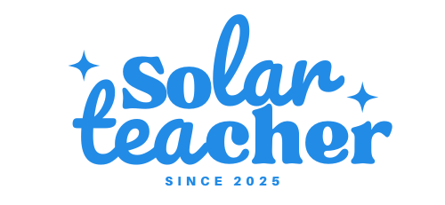
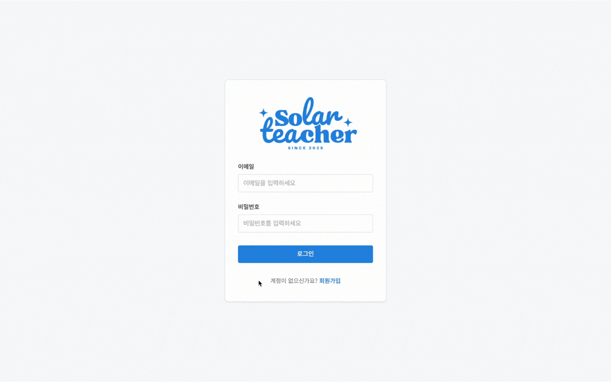
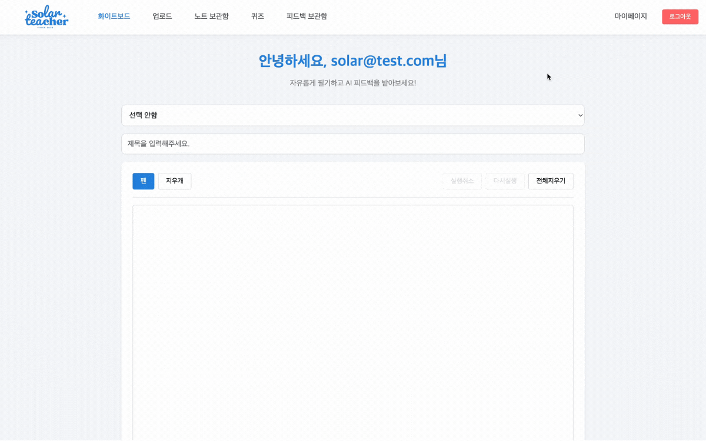
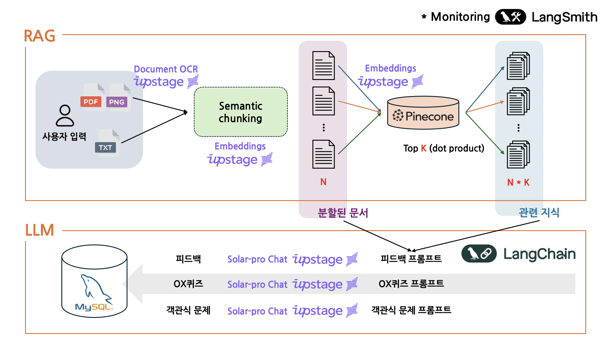
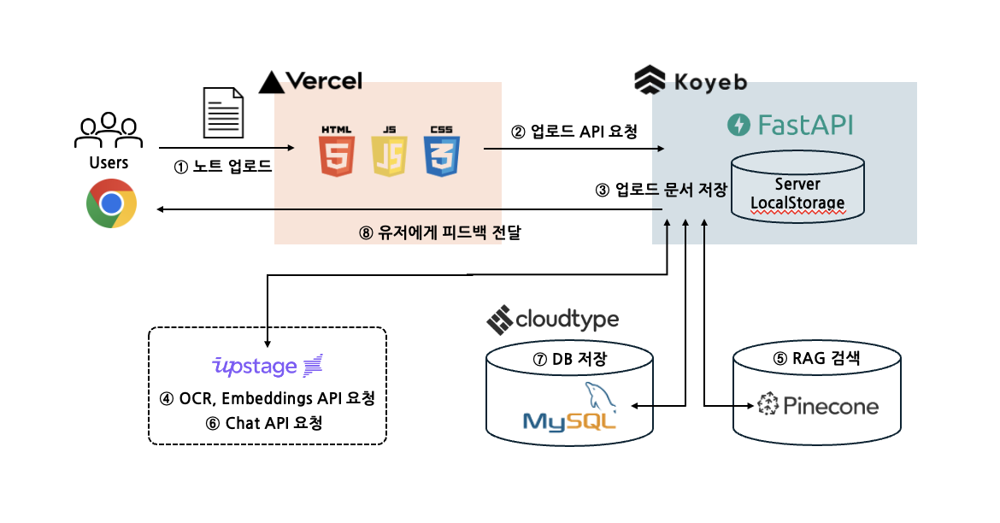
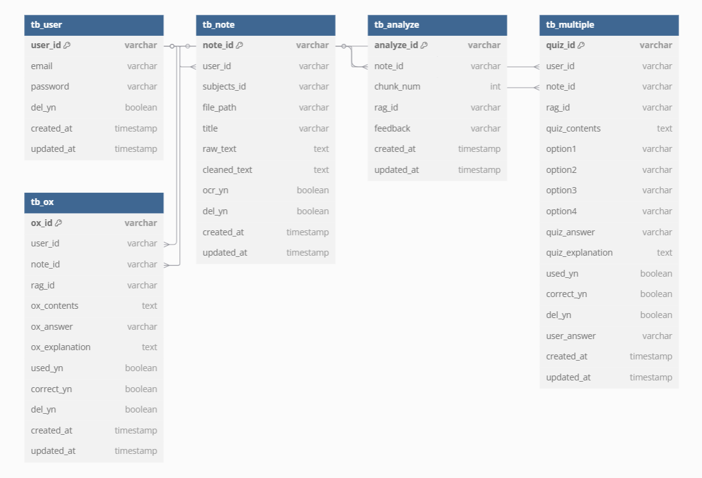

<div align="center">
  <br>
  <picture>
    <source srcset="./docs/imgs/IMGenie_logo_white.png" media="(prefers-color-scheme: dark)">
    
  </picture>

  <h2>AI로 더 효과적인 백지 공부, Solar Teacher</h2></hr>
  백지 공부법의 효과를 극대화하고, 자동 퀴즈 생성을 지원하는 AI 기반 학습 도구입니다.
  <h3><a href="https://solar-teacher.vercel.app"> 📘 직접 사용해보기 🖋️</a></h3>
  <p align="center">
    
    
    
    
    
    
    
    
  </p>
</div>
<br>

```
TEST ID : solar@test.com
TEST PW : 1234
```

## 📑 목차
1. [프로젝트 소개](#-프로젝트-소개)
2. [기능 소개](#-기능-소개)
3. [시연 영상](#-시연-영상)
4. [흐름도](#-흐름도)
5. [설치 및 활용](#-설치-및-활용)
6. [Upstage API 사용 목록](#-Upstage-API-사용-목록)
7. [레파지토리 구조](#-레파지토리-구조)
8. [MySQL DB 구조](#-MySQL-DB-구조)
9. [팀원 구성](#-팀원-구성)
10. [Further Reading](#-Further-Reading)


## 🚀 프로젝트 소개
SolarTeacher는 **백지 공부법**을 활용하는 학습자를 위해 **AI 기반 피드백 및 맞춤형 퀴즈 제공 서비스**입니다.  
이 프로젝트는 **네이버 부스트캠프 AI Tech 7기 기업 해커톤**에서 진행되었으며,  [Upstage API](https://console.upstage.ai/docs/getting-started/overview)를 제공받아 개발되었습니다.

사용자가 필기한 내용을 분석하여 개념 오류를 수정하고, 자동 생성된 퀴즈를 통해 학습 효과를 극대화합니다.

🔹 AI 피드백 제공: 사용자가 작성한 노트의 개념 오류를 분석하여 자동 피드백 제공  
🔹 맞춤형 퀴즈 생성: 노트 내용을 기반으로 OX 및 객관식 퀴즈 자동 생성  
🔹 학습 데이터 관리: 학습 진행 상태를 한눈에 확인하고, 피드백 및 퀴즈 기록 조회

```
백지 공부법이란?
백지 공부법은 빈 종이에 배운 내용을 떠올려 적으며 복습하는 방법으로, 개념을 깊이 이해하고 기억을 강화하는 데 효과적입니다. 
하지만 스스로 오류를 찾기 어렵다는 단점이 있으며, SolarTeacher는 이를 AI 기반 피드백과 맞춤형 퀴즈로 보완합니다.
```

## 🏗️ 기능 소개

### 🔑 로그인 회원가입
- 로그인/회원가입 기능 구현



### ✍️ 노트 업로드  
- 사진, PDF 업로드 및 화이트보드 필기 지원
  - 과목 미선택시 자동 분류 


### 🔍 AI 피드백  & OX 퀴즈
- 필기 내용을 분석하여 피드백 제공
  - 제공 내용: 잘못된 부분, 수정사항, 해설, 출처
- OX 퀴즈 문제 자동 생성


### 🎯 사지선다 퀴즈
- 과목별 객관식 문제 자동 생성
- 퀴즈 해설, 통계 제공
- 풀었던 퀴즈(OX, 사지선다) 모아보기
- 퀴즈 리셋 기능


### 📂 피드백 보관함
- 피드백 모아보기 기능 제공
  - 과목별, 시간순 정렬 가능


### 📊 학습 데이터 관리
- 기본 정보 및 학습 통계 제공



## 🎬 시연 영상  

<p align="left">
  <a href="https://youtu.be/OdiDxrRkwWY">
    
  </a>
  <a href="https://youtu.be/nvqfXGnnRyg">
    
  </a>
</p>


## 🌀 흐름도
### DATA FLOW


### USER FLOW


## 🛠️ 설치 및 활용


### 0️⃣ Anaconda 가상환경 설치

- 가상환경 만들기

```shell
conda create --name solar-teacher python=3.11
```

- 가상환경 활성화

```shell
conda activate solar-teacher
```

- 라이브러리 설치

```shell
pip install -r requirements.txt
```

### 1️⃣ root에 .env 파일 생성

- .env_sample 파일명을 .env로 변경
- API_KEY 변경하기

```bash
# LANGCHAIN_API_KEY=lsv2_
# UPSTAGE_API_KEY=up_
# PINECONE_API_KEY = pcsk_
```
### 2️⃣ 백엔드 실행
```bash
cd backend
python main.py
```
### 3️⃣ 프론트엔드 실행
```
cd frontend
npm install
npm start
```

## 📡 Upstage API 사용 목록

| API                        | 설명                                                     | 사용 위치                  | 사용 위치         |
|-----------------------------|----------------------------------------------------------|----------------------------|----------------------------|
| **Document OCR**           | 이미지 또는 PDF 파일에서 텍스트를 추출하는 기능 | 손글씨 노트 인식      |  [ocr_service.py](https://github.com/boostcampaitech7/level4-recsys-finalproject-hackathon-recsys-04-lv3/blob/main/backend/app/services/ocr_service.py)    |
| **Embeddings**         | 텍스트 데이터를 벡터화하여 의미 기반 검색 및 분석에 활용  | input text 임베딩, RAG data 구축, 시멘틱 검색            | [rag_service.py](https://github.com/boostcampaitech7/level4-recsys-finalproject-hackathon-recsys-04-lv3/blob/main/backend/app/services/rag_service.py)       |
| **Chat**      | 사용자와의 상호작용을 통해 질문 응답 및 대화 생성     | 피드백, OX퀴즈, 사지선다 퀴즈 생성         | [rag_service.py](https://github.com/boostcampaitech7/level4-recsys-finalproject-hackathon-recsys-04-lv3/blob/main/backend/app/services/rag_service.py) |


## 🗂️ 레파지토리 구조
```
.
├── backend
│   ├── app
│   │   ├── api
│   │   │   └── endpoints
│   │   ├── core
│   │   ├── db
│   │   ├── models
│   │   └── services
│   ├── data
│   ├── utils
├── experiments
│   ├── OCR
│   ├── RAG
│   │   └── rag_utils
├── frontend
│   ├── public
│   │   ├── assets
│   │   │   ├── css
│   │   │   ├── images
│   │   │   └── js
│   │   └── components
└── images

```

## 💾 MySQL DB 구조


## 👥 팀원 구성  

| 이름   | GitHub                          | 역할        |
|--------|--------------------------------|------------|
| 강현구 | [@ardkyer](https://github.com/ardkyer) | Backend / Feedback   |
| 서동준 | [@seoo2001](https://github.com/seoo2001) | RAG / Pinecone   |
| 양시영 | [@Lagom92](https://github.com/Lagom92) | RAG / LangSmith |
| 이도걸 | [@doffice0827](https://github.com/doffice0827) | PM / OCR |
| 이수미 | [@SooMiiii](https://github.com/SooMiiii) | Quiz / DB   |


## 🔍 Further Reading
- 발표 영상 
- [발표 자료](https://drive.google.com/file/d/1vLmWR0GHBhjeH-a0TPbuEThDnWKzJjrt/view?usp=sharing)
- 랩업 리포트
